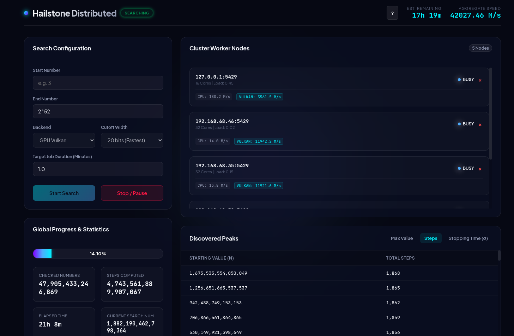

# Hailstone (Collatz) Search Program

This repository implements a high-performance, multi-backend Collatz (3x+1) peak search program. It extends the ideas described in the Leavens-Vermeulen (1992) paper to search for new peaks across three major statistics:
1. **Max Value**: The highest intermediate value reached during the trajectory.
2. **Steps (Total Stopping Time)**: The number of steps taken to reach 1.
3. **Stopping Time ($\sigma$)**: The number of steps taken to fall below the starting value.

To ensure safety and compatibility for values beyond $2^{64}$, calculations are executed using custom 128-bit unsigned integer arithmetic (`uint128`) with overflow checking.

---

## Vermeulen Polynomials & Steps Table Optimization

Vermeulen polynomials and precomputed lookup tables speed up the Collatz search by filtering and shortcutting calculations:

1. **Vermeulen Polynomials (`fpoly` and `mpoly`)**: For any starting value $x \equiv i \pmod{2^w}$, the sequence of odd/even steps is identical until $x$ has been divided by 2 exactly $w$ times.
   - **Final Polynomials (`fpoly`)**: Represents the final state of the residue class after exactly $w$ divisions by 2.
   - **Maximum Intermediate Polynomials (`mpoly`)**: Represents the peak intermediate state along the path where the ratio $\frac{3^a}{2^b}$ is maximized, used to bound peak intermediate values and prune search classes.
2. **Polynomial Step Lookup Optimization**: Instead of running trajectories all the way to 1, the search loops (CPU, HIP, and Vulkan) terminate early when the value drops below $2^8 = 256$. The remaining steps are retrieved in $O(1)$ time from a precomputed steps lookup table (`steps8`). This reduces loop iterations, thread divergence, and instruction counts, accelerating GPU execution by up to **4.0x** and CPU execution by **79%**.
3. **Suffix-First Search (Apriori Cutoffs)**: By generating unique `fpoly` suffix equivalence classes and applying even-class exclusion and modulo 6 filtering, the search is restructured to execute only the non-redundant allowed suffixes. Suffix-First search is enabled by default with width `20` across all backends. On GPU backends (Vulkan and HIP), width `20` is the default and is faster because cache misses on the larger 24-bit table offset the pruning benefits. To disable Suffix-First and run the standard search, pass `--cutoff-width 0`.
4. **64-bit Loop Transition & Steps-Pruning**: Bypassing 128-bit multi-precision arithmetic on the CPU and GPU (HIP & Vulkan) backends once trajectories drop below $2^{32}$ (transitioning to fast, native 64-bit loops), combined with early steps-pruning. By checking if the accumulated steps at the $2^{32}$ transition point plus $1,050$ (the maximum steps possible for starting values $< 2^{32}$) is less than the current global steps peak, we immediately prune the remainder of the trajectory. This delivers a **3.0x speedup** on CPU (overall **4.62x speedup** over unoptimized baseline) and up to **1.97x speedup** on GPUs (yielding throughputs up to **1.11 Billion numbers/s** on Vulkan).
5. **AVX-512 CPU SIMD Vectorization**: Added an AVX-512 vectorized acceleration path on the CPU backend using x86 SIMD intrinsics. This path processes 8 trajectories of 64-bit integers in parallel using 512-bit ZMM registers (`__m512i`), utilizing vector shift-add for $3x+1$ math, vector leading-zero-count arithmetic (`lzcnt`), dynamic lane compaction, and active lane refilling. It features dynamic runtime CPU capability detection (falling back to scalar if unsupported), yielding a **2.11x sequential speedup**, and scales with OpenMP to achieve **506.79 M numbers/s** (an **8.17x parallel scaling speedup**) on 32-core systems while maintaining 100% identical step counts and peak parity.


---

## Architecture & Backends

The project is structured with three computational backends:
* **CPU Reference (`cpu/`)**: A multi-threaded C++ reference implementation using OpenMP to parallelize the search range across CPU cores, serving as the golden standard of correctness.
* **Vulkan Compute (`gpu_vulkan/`)**: A cross-vendor GPU execution backend using Vulkan Compute shaders (`GL_EXT_shader_explicit_arithmetic_types_int64` and Kogge-Stone workgroup prefix scans).
* **HIP ROCm (`gpu_hip/`)**: A highly-optimized GPU backend targeted at AMD hardware (e.g. Strix Halo integrated systems).

To resolve peak buffer limits on the GPU side, the host executes the searches in consecutive chunks of size `2,000,000` values, feeding the global peak thresholds back to the device to prevent candidate log buffer overflows.

To optimize execution, searches lying completely within Block 0 (starting values under $2^{32}$) automatically run using native 64-bit integer arithmetic instead of the custom 128-bit integer type, yielding up to a 3x speedup across CPU and GPU backends.

---

## Directory Structure

```
hailstone/
├── benchmarks/
│   ├── benchmark.py       # Main Python automation benchmark script
│   ├── history.json       # Historical performance logs
│   └── README.md          # Execution record of optimized iterations
├── cpu/                   # CPU Reference implementation
├── doc/                   # Original reference materials
├── gpu_hip/               # AMD HIP (ROCm) backend implementation
├── gpu_vulkan/            # Vulkan Compute backend implementation
├── include/               # Shared headers (uint128 definition and common structs)
├── tests/                 # Unit tests (uint128 verification, differential testing)
├── CMakeLists.txt         # Root CMake build configuration
└── README.md              # This file
```

---

## How to Build

### Prerequisites
* A C++20 compatible compiler (GCC/Clang)
* OpenMP development library (e.g., `libomp-dev` on Ubuntu/Debian if using Clang/Clangd)
* Vulkan SDK (headers and loader)
* `glslc` (shader compiler, usually included in the Vulkan SDK)
* CMake (version 3.16+)
* AMD ROCm Toolkit (optional, for HIP backend)

### Build Steps
1. Create a build directory:
   ```bash
   mkdir build
   cd build
   ```
2. Configure the project:
   ```bash
   cmake -DCMAKE_BUILD_TYPE=Release ..
   ```
3. Compile:
   ```bash
   make -j$(nproc)
   ```

This will build:
* `hailstone_cpu`: CPU reference executable
* `hailstone_vulkan`: Vulkan Compute executable
* `hailstone_verify`: Cross-backend verification executable
* `hailstone_test_uint128`: `uint128` math unit tests
* `hailstone_hip` (if ROCm is found): AMD HIP executable
* `hailstone_path`: Trajectory path representation utility
* `hailstoned`: C++ distributed worker daemon


---

## Usage & Command-Line Options

The search executables (`hailstone_cpu`, `hailstone_vulkan`, and `hailstone_hip`) accept command-line options to configure the search range. We define a **block** as $2^{32}$ items.

### Available Options
* `-h, --help`: Show help and usage instructions.
* `--start-num, --start_num VALUE`: Starting number of the search range (default: `3`).
* `--end-num, --end_num VALUE`: Ending number of the search range (default: `100000`).
* `--start-block, --start_block INDEX`: Starting block index (each block is $2^{32}$ items, overrides `--start-num`).
* `--end-block, --end_block INDEX`: Ending block index (each block is $2^{32}$ items, overrides `--end-num`).
* `--num-blocks, --num_blocks COUNT`: Number of blocks to check (each block is $2^{32}$ items, overrides `--end-num`/`--end-block`).
* `--checkpoint, --checkpoint_file FILE`: Checkpoint file path (default: `hailstone.chk`).
* `--no-checkpoint, --no_checkpoint`: Disable saving and restoring checkpoints.
* `--no-save-checkpoint, --no_save_checkpoint`: Disable saving checkpoints at the end of the search (allows warm-starting from a checkpoint without overwriting it).
* `--use-avx512, --use_avx512`: Force enable AVX-512 vectorized CPU search (enabled by default if supported).
* `--no-avx512, --no_avx512`: Force disable AVX-512 vectorized CPU search.
* `--cutoff-width, --cutoff_width VALUE`: Configure the bit-width of Suffix-First search (accepts `8`, `12`, `16`, `20`, or `24`). Suffix-First search is enabled by default with width `20` across all backends. To disable Suffix-First and run the standard search, pass `--cutoff-width 0`.
* `--domain-switching, --domain_switching`: Enable David Bařina's domain-switching arithmetic (supported on CPU, AVX-512, Vulkan, and HIP backends). This option yields speedups at very high block ranges on CPU backends (up to +31.6% at Block 100,000), but incurs overhead/slowdown on GPU backends due to the emulation of 128-bit operations.
* `--no-domain-switching, --no_domain_switching`: Disable David Bařina's domain-switching arithmetic (default).


### Controlling CPU Thread Count
The CPU search uses OpenMP to scale computations across all available CPU cores. To control the number of threads used, set the standard `OMP_NUM_THREADS` environment variable:
```bash
OMP_NUM_THREADS=4 ./hailstone_cpu --start-num 3 --end-num 100000
```

### Checkpointing & Resumption
State checkpointing is enabled by default. Before completing, search programs save the baseline peak thresholds, the list of all peaks, and the last number checked to a checkpoint file.
- When continuing a search, running the binary with no starting bound options will resume from `last_num + 1` of the checkpoint.
- If no ending boundary is provided on a resumed run, the search range size defaults to `100,000` numbers.
- If an explicit starting range (`--start-num` / `--start-block`) is passed, the search will respect that start point, but will still load baseline peak thresholds from the checkpoint.

*Note: Backward-compatible positional arguments (`[start] [end]`) are still supported as a fallback if no named range options are provided.*

### Examples
1. **Numeric Range** (ignoring checkpoints):
   ```bash
   ./hailstone_cpu --no-checkpoint --start-num 3 --end-num 100000
   ```
2. **Resuming Search from Checkpoint**:
   ```bash
   # Resume and run for another 100,000 numbers from where the default checkpoint left off
   ./hailstone_cpu
   ```
3. **Block Range** (e.g. 8GB test configuration covering blocks 0 and 1):
   ```bash
   ./hailstone_vulkan --start-block 0 --num-blocks 2
   ```
4. **Legacy Positional Fallback**:
   ```bash
   ./hailstone_hip 3 100000
   ```

---

## Trajectory Path Utility (`hailstone_path`)

The `hailstone_path` utility creates a string representation of the trajectory path a starting number takes:
* `*` represents a $3x+1$ step followed by division by 2.
* `/` represents any other division by 2.
* `^` indicates the peak value reached.
* `|` records the point where the stopping time occurs (first fall below the starting value).

### Exception Rules
The combined `*` step is split into separate multiplication (`*`) and division (`/`) steps if either the peak (`^`) or the stopping time (`|`) falls on the multiplication step.

### Options
* `-s, --statistics`: Prints summary statistics, including total stopping steps ($H$-trajectory), stopping time ($T$-trajectory steps to drop below start number), and peak value reached.
* `-v, --verbose`: Prints each step incrementally on its own line showing the symbol and the value.

### Examples
1. **Standard Output**:
   ```bash
   ./hailstone_path 5
   # Output: *^//|/
   ```
2. **Verbose Step-by-Step**:
   ```bash
   ./hailstone_path 5 -v
   # Output:
   # * 16
   # ^ 16
   # / 8
   # / 4
   # | 4
   # / 2
   ```
3. **Summary Statistics**:
   ```bash
   ./hailstone_path 3 -s
   # Output:
   # **^///|
   # Steps: 7
   # Stopping Time: 4
   # Max Value: 16
   ```

---

## Verification & Benchmarks

### 1. Run Verification Suite
Before benchmarking, always verify backend correctness. Run the differential integration test from the build directory:
```bash
./hailstone_verify
```

### 2. Run Benchmarks
Use the Python benchmark driver from the root directory to run benchmarks and log performance metrics:
```bash
# Run a quick check (100M values) to verify performance
python3 benchmarks/benchmark.py --mode quick

# Run the full benchmark run up to 2^32 * 2 (8,589,934,592)
python3 benchmarks/benchmark.py --mode full
```

Benchmark results and peak counts will automatically append to the optimization history in [benchmarks/README.md](file:///home/mev/source/ai/hailstone/benchmarks/README.md) and [benchmarks/history.json](file:///home/mev/source/ai/hailstone/benchmarks/history.json).

### 3. Extended Configuration Sweep (Block 100,000)
To evaluate trade-offs in the 128-bit search space, we run the extended sweep driver (`extended_sweep.py`) at Block 100,000 (checking 1,000,000,000 starting numbers). Since search ranges smaller than a full block ($2^{32}$ values) run sequentially on a single thread on the CPU, the CPU configurations are benchmarked with 1 thread. Below is the performance matrix of backends, thread counts, SIMD instruction sets, domain-switching, and suffix-first cutoff widths:

| Backend | Threads | [AVX-512](doc/optimizations_illustrated.md#parallelization--vectorization) | [Domain Switch](doc/optimizations_illustrated.md#domain-switching-arithmetic) | [Cutoff Width](doc/optimizations_illustrated.md#cutoffs--suffix-first-search) | Time (s) | Computational Throughput (M/s) | Comp. Speedup | Search Coverage Speed (M/s) | Coverage Speedup |
|---|---|---|---|---|---|---|---|---|---|
| CPU | 1 | ON | ON | 20 | 7.419 | 14.99 | 1.46x | 134.80 | 6.57x |
| CPU | 1 | ON | ON | 24 | 5.949 | 15.27 | 1.49x | 168.10 | 8.19x |
| CPU | 1 | ON | OFF | 20 | 9.784 | 11.37 | 1.11x | 102.20 | 4.98x |
| CPU | 1 | ON | OFF | 24 | 8.169 | 11.12 | 1.08x | 122.41 | 5.97x |
| CPU | 1 | OFF | ON | 0 | 53.298 | 9.38 | 0.91x | 18.76 | 0.91x |
| CPU | 1 | OFF | ON | 20 | 10.789 | 10.31 | 1.00x | 92.69 | 4.52x |
| CPU | 1 | OFF | ON | 24 | 8.791 | 10.33 | 1.01x | 113.75 | 5.54x |
| CPU | 1 | OFF | OFF | 0 | 48.744 | 10.26 | 1.00x (Base) | 20.52 | 1.00x (Base) |
| CPU | 1 | OFF | OFF | 20 | 9.738 | 11.42 | 1.11x | 102.70 | 5.00x |
| CPU | 1 | OFF | OFF | 24 | 7.883 | 11.52 | 1.12x | 126.85 | 6.18x |
| VULKAN | N/A | N/A | ON | 0 | 1.897 | 263.63 | 25.70x | 527.26 | 25.70x |
| VULKAN | N/A | N/A | ON | 20 | 0.307 | 362.58 | 35.34x | 3260.52 | 158.90x |
| VULKAN | N/A | N/A | ON | 24 | 0.265 | 342.61 | 33.39x | 3772.16 | 183.83x |
| VULKAN | N/A | N/A | OFF | 0 | 0.778 | 642.62 | 62.63x | 1285.18 | 62.63x |
| VULKAN | N/A | N/A | OFF | 20 | 0.131 | 848.82 | 82.73x | 7633.59 | 371.99x |
| VULKAN | N/A | N/A | OFF | 24 | 0.107 | 849.09 | 82.76x | 9345.79 | 455.45x |
| HIP | N/A | N/A | ON | 0 | 0.872 | 573.26 | 55.87x | 1146.53 | 55.87x |
| HIP | N/A | N/A | ON | 20 | 0.125 | 891.27 | 86.87x | 8012.82 | 390.49x |
| HIP | N/A | N/A | ON | 24 | 0.111 | 816.04 | 79.54x | 8984.73 | 437.85x |
| HIP | N/A | N/A | OFF | 0 | 0.602 | 830.58 | 80.95x | 1661.13 | 80.95x |
| HIP | N/A | N/A | OFF | 20 | 0.114 | 972.28 | 94.76x | 8741.26 | 425.99x |
| HIP | N/A | N/A | OFF | 24 | 0.086 | 1056.01 | 102.93x | 11627.91 | 566.66x |

#### Key Observations
* **Search Coverage Speed vs. Computational Throughput**:
  * For standard search (`Cutoff Width = 0`), the search coverage speed is exactly $2\times$ the computational throughput since the search only skips even numbers (50% pruning).
  * For suffix-first search (`Cutoff Width = 20` or `24`), apriori cutoffs prune away approximately **88.5%** of the trajectories. As a result, the search coverage speed (logical scan rate) scales up by **~8.7x** relative to computational throughput. For instance, the **HIP (DS: OFF, Cutoff: 24)** config achieves `1056.01 M/s` of computational throughput but sweeps the range at a staggering **11,627.91 M/s** (a **566.66x speedup** over the CPU baseline).
* **Domain Switching Trade-offs (CPU vs. GPU)**:
  * **Helps CPU**: Domain switching reduces trajectory step counts. In the CPU backend, this translates to instruction savings, boosting throughput by **+31% to +33%** when combined with AVX-512 ON and suffix-first search (e.g., from `11.52 M/s` to `15.27 M/s` at width 24).
  * **Hurts GPU**: GPU threads are highly sensitive to branch divergence and the math emulation overhead of executing 128-bit domain-switching trajectories. Enabling domain-switching on GPUs results in a performance hit (e.g., HIP's coverage speed drops from `11,627.91 M/s` to `8,984.73 M/s` at width 24).
* **Where AVX-512 Vectorization Excel**:
  * **Only active in Suffix-First**: AVX-512 vectorization is only implemented in the suffix-first search paths (`Cutoff > 0`). When Cutoff is 0, AVX-512 ON/OFF yields identical throughput as both fall back to the standard scalar loop.
  * **Requires Domain Switching to offset lane refill overhead**: Because AVX-512 lanes finish at different times and require active lane refilling from stack memory, this microarchitectural overhead makes AVX-512 slightly slower than the simple scalar loop when Domain Switching is OFF. However, when Domain Switching is ON, the vector gather and multiplication execution rate is fast enough to offset this overhead, delivering a **~42% to 45% speedup** (e.g., throughput increases from `10.33 M/s` to `15.27 M/s` at width 24).

### 4. CPU Profiling
The project includes support for building profiling targets with `-g` and `-fno-omit-frame-pointer` flags to enable source-annotated analysis using `perf`. For detailed build, record, and report instructions, see the [CPU Profiling Guide](file:///home/mev/source/ai/hailstone/doc/2026-06-15-profiling.md).

---

## Distributed Search Mode



The distributed search mode splits the Collatz peak search range across a cluster of worker machines. It comprises a highly optimized C++ daemon and a Python central controller:

1. **Worker Daemon (`hailstoned`)**: A high-performance C++ daemon that runs on each worker machine. It auto-detects compiled binaries (CPU, Vulkan, HIP), runs startup micro-benchmarks to register local capabilities, and communicates with the central controller via a raw TCP socket protocol.
2. **Central Controller (`distributed/controller.py`)**: Runs on the coordinator machine. It partitions the search range dynamically based on workers' throughputs, schedules tasks, manages timeouts (fault tolerance), merges peaks using a strict sorting/filtering algorithm, and hosts a premium Web UI.

### Step-by-Step Setup

1. **Package and Deploy the Daemon** to all worker machines:
   On a build machine, run the Debian packager script to compile the binaries and generate a `.deb` package containing the daemon and an `xinetd` service configuration:
   ```bash
   ./distributed/package_deb.sh
   ```
   Copy the generated Debian package to your worker machines and install it (the script derives the version automatically from git tags, e.g., `hailstoned_1.3.0_amd64.deb`):
   ```bash
   sudo dpkg -i hailstoned_<version>_amd64.deb
   sudo apt-get install -f  # To install any missing dependencies like xinetd
   ```
   *Alternatively, you can build the binaries manually (`make hailstoned hailstone_cpu`) and run `./build/hailstoned --port 5429` as a standalone background process.*

2. **Start the Controller** on the host server:
   ```bash
   python3 distributed/controller.py --workers worker1_ip:5429,worker2_ip:5429 --port 8080 --checkpoint hailstone_distributed.chk
   ```

4. **Monitor and Control via Web UI**:
   Open a browser to `http://<controller_ip>:8080`.
   - Configure a search range, select the target backend, adjust the **Target Job Duration** (used to size chunks dynamically), and start/pause searches.
   - **Flexible Inputs**: The web interface supports math expressions (e.g., `2^32` or `2**32`) and scientific notation (e.g., `1e12`).
   - **Continuous & Resume Mode**: Leave the **Start Number** blank to automatically resume from the loaded checkpoint. Leave the **End Number** blank to run an infinite continuous search.
   - Discovered peaks are immediately merged and saved to `hailstone_distributed.chk` in real-time. This file is 100% compatible with the standard single-node C++ binaries.

