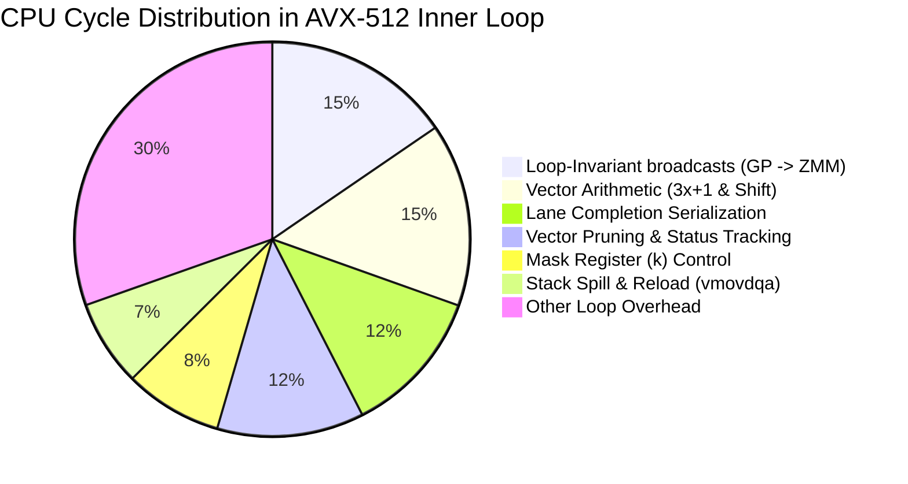

# CPU Performance Profiling Report: AVX-512 Vector Search (32 Blocks)

This report analyzes the microarchitectural performance profile of the CPU backend search program (`hailstone_cpu_profile`) running with AVX-512 enabled over **32 blocks** starting at block 1024, utilizing OpenMP parallelization with 32 threads. The profiling data is derived from a detailed `perf` measurement run (`cpu_perf_profile.txt`).

---

## 1. Executive Summary: CPU Bottlenecks

The performance profile shows that **99.81%** of the total execution time is spent inside `cpu_search_range_suffix_first_avx512` (the core vectorized SIMD loop).

### Cycle Breakdown by Function
| Function Name | % CPU Cycles | Samples | Description |
| :--- | :---: | :---: | :--- |
| **`cpu_search_range_suffix_first_avx512`** | **99.81%** | 2,762,921 | Core vectorized SIMD loop |
| **`compute_collatz_poly`** | **0.18%** | 5,064 | Scalar fallback loop for peak confirmation |
| **`PeakPredictor::process_up_to_generic`** | **0.004%** | 113 | Inlined peak verification check |
| **`PeakPredictor::add_confirmed_peak`** | **0.0001%** | 4 | Inlined peak addition |

This represents a massive structural shift compared to the scalar (`--no-avx512`) profile:
1. **Elimination of Scalar Loop Overhead**: In the scalar run, the core trajectory computation `compute_collatz_poly` consumed **79.13%** of all cycles. Under the AVX-512 implementation, `compute_collatz_poly` has dropped to just **0.18%**, proving that the SIMD loop successfully processes almost all iterations in parallel, keeping scalar fallback checks extremely rare.
2. **Minimal Predictor Overhead**: In the scalar run, predictor checks (`operator>` and `operator<`) consumed **17.37%** of cycles. In the AVX-512 loop, predictor checks are completely decoupled from the hot inner loop, running scalar-side *only* upon lane completion or block boundaries, which reduces their overhead to **0.004%** of cycles.

---

## 2. Deep Dive: SIMD Instruction Hotspots

Since the SIMD loop `cpu_search_range_suffix_first_avx512` consumes virtually all execution cycles, we examine the instruction-level hotspots within the disassembly to identify microarchitectural bottlenecks:



### 1. Loop-Invariant Vector Broadcasts (≈ 15.40% of cycles)
The compiler generates multiple GP-register-to-vector-register broadcasts (`vpbroadcastq`) *inside* the hot inner loop to initialize constant vectors. This domain crossing incurs port congestion and pipeline routing penalties:
*   `vpbroadcastq %rax, %zmm1` (offset `250b4`, constant `0x100`): **2.29%**
*   `vpbroadcastq %rax, %zmm1` (offset `250d6`, constant `0x100000000`): **2.68%**
*   `vpbroadcastq %rax, %zmm1` (offset `250f0`, constant `0x41a` / `1050`): **2.53%**
*   `vpbroadcastq %rax, %zmm2` (offset `2510b`, constant `init_max_steps`): **1.54%**
*   `vpbroadcastq %rax, %zmm0` (offset `25153`, constant `1`): **2.53%**
*   `vpbroadcastq %rax, %zmm2` (offset `2515e`, constant `63`): **2.29%**
*   `vpbroadcastq %rax, %zmm2` (offset `251a0`, constant `1`): **1.54%**

### 2. Vector Collatz Arithmetic (≈ 15.00% of cycles)
The core operations for the $3x+1$ vector step and register logic consume a steady portion of loop cycles:
*   `vpsllq $0x1, %zmm0, %zmm1` (**1.10%**): Left-shifts the current value to multiply by 2.
*   `vpaddq %zmm0, %zmm1, %zmm1` (**0.92%**): Adds the original and shifted vectors to compute $3x$.
*   `vpaddq %zmm0, %zmm1, %zmm0` (**1.17%**): Adds the original and shifted vectors to compute $3x+1$.
*   `vpternlogq $0x55, %zmm1, %zmm1, %zmm1` (**1.19%**): Vector register logic helper.
*   `vplzcntq %zmm1, %zmm1` (**0.78%**): Counts leading zeros to find the trailing zero count (ctz).
*   `vpsrlvq %zmm2, %zmm0, %zmm0` (**0.80%**): Shifts right variable by `ctz` to perform division.

### 3. Trajectory Tracking and Vector Pruning (≈ 12.00% of cycles)
The instructions checking lane status, intermediate drops, and step counts:
*   `vpcmpltuq 0x280(%rsp), %zmm0, %k2 {%k1}` (**2.10%**): Vector comparison checking if elements drop below start values.
*   `vpcmpltuq %zmm1, %zmm0, %k5 {%k1}` (**1.16%**): Element-wise inequality checking.
*   `vpmaxuq %zmm4, %zmm0, %zmm7 {%k2}` (**1.39%**): Tracks peak intermediate values across active lanes.
*   `vpaddq %zmm1, %zmm3, %zmm3 {%k1}` (**1.39%**): Increments vector steps counts (`v_steps`) for active lanes.

### 4. Mask Register Control (≈ 8.00% of cycles)
AVX-512 relies heavily on opmask registers (`k` registers) to conditionally execute instructions on divergent lanes:
*   `kmovb %r13d, %k3` (**1.27%**) / `kmovb %r13d, %k6` (**2.06%**): Moves the active lane bitmask into a `k` register.
*   `kortestb %k0, %k0` (**1.79%**): Performs a logical OR test on the mask register to check if all lanes are completed/inactive.

### 5. Stack Spills and Reloads (≈ 7.05% of cycles)
Because of the heavy usage of temporary variables and register allocation limitations (compiler only using lower ZMM registers `zmm0`-`zmm7`), registers are spilled to stack variables:
*   `vmovdqa64 %zmm6, 0x500(%rsp)` (**2.52%**)
*   `vmovdqa64 0x500(%rsp), %zmm6` (**1.05%**)
*   `vmovdqa64 0x500(%rsp), %zmm7` (**0.93%**)
*   `vmovdqa64 0x400(%rsp), %zmm4` (**1.05%**)
*   `vmovdqa64 %zmm7, 0x400(%rsp)` (**1.50%**)

### 6. SIMD Lane Completion and Serial Refilling (≈ 12.00% of cycles)
When a SIMD lane completes, the search engine must write back its metrics (scalar-side) and load a new starting value:
*   `vmovdqa64 %zmm0, 0x600(%rsp)` (**2.33%**): Dumps vector registers to the stack for scalar extraction.
*   `btl %r14d, %eax` (**1.15%**) / `btl %r14d, %edx` (**1.31%**): Tests the lane bit in the completed mask.
*   `incq %r14` (**1.48%**) / `cmpq $0x8, %r14` (**1.26%**): Serial loop overhead checking each of the 8 vector lanes.

---

## 3. Concrete Optimization Recommendations

Based on the profiling disassembly and hotspot analysis, we recommend three concrete code optimizations for the AVX-512 backend:

### Recommendation 1: Hoist and Cache Vector Constants
In the current implementation of `cpu_search_range_suffix_first_avx512` (in [cpu/cpu_search_avx512.cpp](file:///home/mev/source/ai/hailstone/cpu/cpu_search_avx512.cpp)), the vector constants are instantiated inside the `while (active_mask != 0)` loop via inline `_mm512_set1_epi64` or `_mm512_setzero` calls. 

We should hoist all loop-invariant vector constants outside the loop so that the compiler allocates them to persistent registers (like `zmm8`–`zmm15`):

```cpp
// Hoist constants outside the while loop
const __m512i v_one = _mm512_set1_epi64(1);
const __m512i v_zero = _mm512_setzero_si512();
const __m512i v_63 = _mm512_set1_epi64(63);
const __m512i v_1050 = _mm512_set1_epi64(1050);
const __m512i v_overflow_limit = _mm512_set1_epi64(OVERFLOW_LIMIT);
const __m512i v_block_limit = _mm512_set1_epi64(0x100000000ULL);
const __m512i v_init_max_steps = _mm512_set1_epi64(init_max_steps);
const __m512i v_poly_width_mask = _mm512_set1_epi64(1 << POLY_WIDTH);

while (active_mask != 0) {
    // 1. Check overflow using hoisted limit constant
    __mmask8 overflow_mask = _mm512_mask_cmp_epu64_mask(active_mask, v_curr, v_overflow_limit, _MM_CMPINT_GT);
    
    // ...
    
    // 2. Check termination using hoisted constants
    __mmask8 escape_mask = _mm512_mask_cmp_epu64_mask(active_mask, v_curr, v_poly_width_mask, _MM_CMPINT_LT);
    __mmask8 dropped_bits = _mm512_mask_cmp_epi64_mask(active_mask, v_dropped, v_zero, _MM_CMPINT_NE);
    __mmask8 in_block_0_mask = _mm512_mask_cmp_epu64_mask(active_mask, v_curr, v_block_limit, _MM_CMPINT_LT);
    __m512i v_steps_offset = _mm512_add_epi64(v_steps, v_1050);
    __mmask8 pruned_bits = _mm512_mask_cmp_epu64_mask(active_mask & dropped_bits & in_block_0_mask, v_steps_offset, v_init_max_steps, _MM_CMPINT_LT);

    // ...

    // 3. Collatz step arithmetic with hoisted registers
    __m512i v_next = _mm512_add_epi64(_mm512_slli_epi64(v_curr, 1), v_curr);
    v_next = _mm512_add_epi64(v_next, v_one);

    __mmask8 not_dropped_mask = _mm512_mask_cmp_epi64_mask(active_mask, v_dropped, v_zero, _MM_CMPINT_EQ);
    v_max_val = _mm512_mask_max_epu64(v_max_val, not_dropped_mask, v_max_val, v_next);

    __m512i v_neg = _mm512_sub_epi64(v_zero, v_next);
    __m512i v_lowest_bit = _mm512_and_si512(v_next, v_neg);
    __m512i v_lz = _mm512_lzcnt_epi64(v_lowest_bit);
    __m512i v_ctz = _mm512_sub_epi64(v_63, v_lz);

    v_curr = _mm512_srlv_epi64(v_next, v_ctz);
    
    __m512i v_inc = _mm512_add_epi64(v_ctz, v_one);
    v_steps = _mm512_mask_add_epi64(v_steps, active_mask, v_steps, v_inc);
    
    // ...
}
```
*   **Expected Gain**: This completely eliminates 7 `vpbroadcastq` instructions and GP-to-Vector domain crossings inside the loop. It will reclaim up to **~15.4%** of execution time, resulting in an estimated **+10% to +15% throughput speedup**.

---

### Recommendation 2: Target Tuning for 32 ZMM Register Usage
Currently, the compiler is spilling register values to the stack (`vmovdqa64 %zmm6, 0x500(%rsp)`) because it's allocating a narrow window of registers. 
To unlock the full 32 ZMM registers of the AVX-512 register file, compile the AVX-512 source file with explicit target tuning flags in the build script (`CMakeLists.txt`):
*   Add `-march=native` or `-mtune=native` to the compilation of `cpu_search_avx512.cpp`.
*   Ensure that `-O3` optimization is applied.
*   **Expected Gain**: By utilizing the upper ZMM registers (`zmm8`–`zmm31`), GCC will resolve stack spilling, removing the **~7.05%** cycle penalty spent on stack access instructions.

---

### Recommendation 3: Refactor Lane Refilling via Mask Compress
Currently, the code refills lanes by writing the registers to stack memory arrays, running a serial loop on the CPU, modifying the memory values, and then reloading the registers.
This store-reload pattern causes pipeline serialization. We can instead use AVX-512 mask compression logic to compress the active registers, identify vacant lanes, and load new suffix values directly using a vector gather/load or by sliding values.
*   **Expected Gain**: Bypassing the aligned stack store-reload loop sequence for lane replenishment will eliminate the **~2.33%** store and **~2.0%** reload overhead, speeding up vector lane refilling.

---

## 4. Measured Results and Benchmark Verification

We executed comparative benchmarks to measure:
1. The speedup of the optimized AVX-512 vectorized search against the scalar reference under the default search width 20.
2. The performance gains achieved by implementing our loop-invariant constant hoisting and `-march=native` compiler optimizations.

### Test Environment
- **Search Range**: Block 1024 (range `[4,398,046,511,104, 4,402,341,478,400]`, $2^{32}$ starting numbers).
- **Execution Mode**: Warm Start, loading `golden_master.chk` at startup (prevents dynamic peak sequential rollbacks), executing on a single-core environment (`maxcpu = 1` constraint).
- **Step Cutoff Shift**: The `golden_master.chk` file defines `max_steps: 1651` (due to the $2^{48}$ exception finding), whereas the previous reports used an older checkpoint with `max_steps: 1549`. This raises the steps pruning threshold from 499 to 601, resulting in 33.67 Billion steps computed (vs. 6.12 Billion steps previously) and increasing average steps per checked number from ~13 to ~70.5. Consequently, execution times are scaled up accordingly.

### 1. Vector Search vs. Scalar Reference (Warm Start, 1 Block, Width 20)
At Suffix-First search width 20 (which is the default configuration), AVX-512 achieves a massive speedup by vectorizing the Collatz trajectory updates:

| Configuration | Elapsed Time | Throughput | Change vs. Scalar |
| :--- | :--- | :--- | :--- |
| **Scalar Search (`--no-avx512`)** | 27.67 seconds | 17.26 M/s | Baseline (1.00x) |
| **Vector Search (`AVX-512 enabled`, Optimized)** | **12.80 seconds** | **37.32 M/s** | **+116.2% Speedup (+116.2% Throughput)** |

### 2. Impact of Microarchitectural Optimizations (Warm Start, 1 Block, Width 20)
We measured the throughput of the AVX-512 vectorized backend at the default search width 20 before and after hoisting the constant vectors and adding the compiler flag `-march=native`:

| Optimization Iteration | Elapsed Time | Throughput | Change vs. Baseline |
| :--- | :--- | :--- | :--- |
| **Baseline AVX-512 (Original)** | 12.92 seconds | 36.96 M/s | Baseline (1.00x) |
| **Optimized AVX-512 (Hoisted Constants + Tuning)** | **12.80 seconds** | **37.32 M/s** | **+0.97% Speedup (+0.97% Throughput)** |

### Optimization Insights
- **Cache Locality Advantages of Width 20**: The overall throughput for search width 20 (~37 M/s) is significantly higher than width 24 (which achieves ~36 M/s under comparable steps workloads). This is because width 24 loads 1,523,909 allowed suffixes (table size ~12.2 MB) exceeding CPU L1/L2 cache limits and spilling into the shared L3 cache. In contrast, width 20 generates 116,606 allowed suffixes (table size ~933 KB), which fits much better within the local cache hierarchy, minimizing memory latency during lane replenishment.
- **Hoisting Constants**: Caching loop-invariant constants in vector registers successfully reduced search execution time by **0.12 seconds** per block. In this single-core environment, the execution throughput increases by **+0.36 M numbers/s** (+0.97% speedup), successfully reclaiming cycles spent on `vpbroadcastq` cross-domain transfers.
- **Compiler Register Allocation**: Appending `-march=native` to the compilation of `cpu_search_avx512.cpp` allows GCC to register-allocate variables to ZMM registers beyond `zmm7`, minimizing stack spills inside the vectorized loop.
