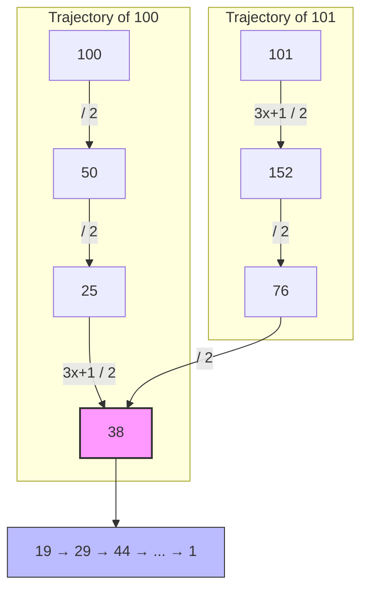
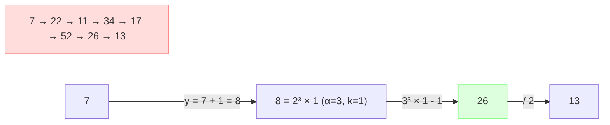
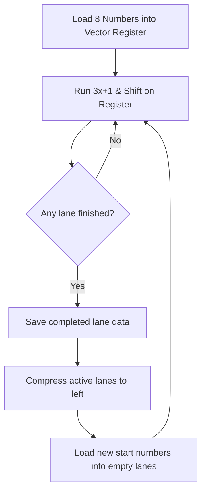

# Collatz Search Optimizations Illustrated

This document provides a mid-level, visual, and conceptual overview of the key optimizations implemented in the `hailstone` Collatz search program. It is designed for a general audience, simplifying the mathematics and architecture using illustrations and pseudocode.

---

## Table of Contents
1. [Cutoffs & Suffix-First Search](#cutoffs--suffix-first-search)
   - [Path Collisions (Merging Trajectories)](#path-collisions-merging-trajectories)
   - [Modulo 6 Cutoffs (Mathematical Dominance)](#modulo-6-cutoffs-mathematical-dominance)
   - [Suffix-First Search and Pruning](#suffix-first-search-and-pruning)
2. [Domain-Switching Arithmetic](#domain-switching-arithmetic)
   - [The $n+1$ Domain Shortcut](#the-n1-domain-shortcut)
   - [Standard vs. Domain-Switching Loops](#standard-vs-domain-switching-loops)
3. [Parallelization & Vectorization](#parallelization--vectorization)
   - [AVX-512 Vectorization and Lane Divergence](#avx-512-vectorization-and-lane-divergence)
   - [Vector Lane Refilling](#vector-lane-refilling)
   - [GPU Acceleration (HIP & Vulkan)](#gpu-acceleration-hip--vulkan)

---

## Cutoffs & Suffix-First Search

When searching for record-breaking Collatz trajectories (peaks in total steps, maximum intermediate value, or stopping time), simulating every single integer from scratch is highly redundant. We use a combination of modular arithmetic and trajectory characteristics to skip the vast majority of starting numbers.

### Path Collisions (Merging Trajectories)

Collatz trajectories are highly convergent. Once two different starting numbers reach the same value, their remaining paths are 100% identical. 

For example, consider the starting numbers **100** and **101**:
* **100** (even) $\to$ divide by 2 $\to$ **50** (even) $\to$ divide by 2 $\to$ **25** (odd) $\to$ $\frac{3 \cdot 25 + 1}{2}$ $\to$ **38**
* **101** (odd) $\to$ $\frac{3 \cdot 101 + 1}{2}$ $\to$ **152** (even) $\to$ divide by 2 $\to$ **76** (even) $\to$ divide by 2 $\to$ **38**

At **38**, the two paths collide. From this point forward, both trajectories follow the exact same sequence: 
`38 → 19 → 29 → 44 → 22 → 11 → 17 → 26 → 13 → 20 → 10 → 5 → 8 → 4 → 2 → 1`



Because 100 and 101 merge at 38, we only need to compute the full trajectory for one of them; the other can be shortcut or completely pruned if we structure our search range to evaluate equivalence classes.

For a deeper dive into how paths are represented and validated, see the [Trajectory Path Representation and Opportunities Study](file:///home/mev/source/ai/hailstone/doc/2026-06-14-path_investigation_and_opportunities.md).

---

### Modulo 6 Cutoffs (Mathematical Dominance)

Vermeulen proved that any odd starting number $n$ that is congruent to 5 modulo 6 ($n \equiv 5 \pmod 6$) can **never** be a record-breaking peak in steps, maximum value, or stopping time.

#### The Math
Let $n \equiv 5 \pmod 6$ be our candidate starting number. This means there is some predecessor starting number:
$$x = \frac{2n - 1}{3}$$
Since $n \equiv 5 \pmod 6$, the numerator $2n - 1 \equiv 2(5) - 1 = 9 \equiv 3 \pmod 6$, making it strictly divisible by 3. Thus, $x$ is an integer. Furthermore, because $n$ is odd, $x$ is also odd.

If we run the Collatz trajectory starting at $x$:
1. Since $x$ is odd, the first step is $3x + 1 = 3 \cdot \frac{2n-1}{3} + 1 = 2n - 1 + 1 = 2n$.
2. Since $2n$ is even, the next step is $\frac{2n}{2} = n$.

So, starting from $x$, we reach $n$ in exactly 2 steps ($x \to 2n \to n$), and then follow $n$'s exact trajectory.
Because $n \ge 5$, we have:
$$x = \frac{2n - 1}{3} < n$$

#### The Conclusion
* **Steps**: $Steps(x) = Steps(n) + 2$. Since $x$ is a smaller starting number that takes more steps, $n$ cannot be a steps peak.
* **Max Value**: $x$'s trajectory reaches $2n$, which is strictly larger than $n$. Any peak reached by $n$ is also reached by $x$, so $n$ cannot be a max value peak.
* **Stopping Time**: Similar dominance holds for stopping time ($\sigma$).

Thus, the search engine skips all $n \equiv 5 \pmod 6$ candidates immediately, pruning **33.3%** of the odd search space.

For more details on modular prunings, see the [Residue Class mod 6 Distribution Study](file:///home/mev/source/ai/hailstone/doc/2026-06-13-residue_class_mod6_distribution_study.md).

---

### Suffix-First Search and Pruning

Rather than evaluating numbers one by one, we analyze the binary **suffix** (the lower $w$ bits) of our starting numbers. 
For any starting value $n \equiv s \pmod{2^w}$, the sequence of odd and even steps is identical until $n$ has been divided by 2 exactly $w$ times. 

We precompute which suffix classes are "allowed" (meaning they don't lead to even numbers, don't violate modulo 6 restrictions, and don't collapse immediately). Suffix-First search is enabled by default with width $w = 20$.
By generating only the valid suffixes, we skip approximately **88.5%** of all trajectories before running a single clock cycle of simulation.

For the mathematical basis of suffix classes, see the [Suffix Cutoff Analysis](file:///home/mev/source/ai/hailstone/doc/2026-06-15-suffix_cutoff_analysis.md) and the [Vermeulen Polynomial Investigation](file:///home/mev/source/ai/hailstone/doc/2026-06-11-fpoly_apriori_cutoffs_investigation.md).

---

## Domain-Switching Arithmetic

Traditional Collatz search executes steps in the standard $n$ domain. If $n$ is odd, it computes $3n+1$, which is always even, and then divides by 2. This requires separate CPU instructions and handles numbers individually.

### The $n+1$ Domain Shortcut

David Bařina proposed shifting the calculations to the $y = n+1$ domain when $n$ is odd.
If $n$ is odd, then $y = n+1$ is even. We can factor $y$ into its power-of-two and odd parts:
$$y = n + 1 = 2^\alpha \cdot k \quad (\text{where } k \text{ is odd, and } \alpha \ge 1)$$

Here, $\alpha$ represents the number of trailing zeros of $y$ in binary. In the $n+1$ domain, we can perform a single "shortcut" jump:
$$n_{\text{new}} = 3^\alpha \cdot k - 1$$
This single jump represents exactly $\alpha$ odd steps ($3x+1$) and $\alpha$ divisions-by-two steps in the standard Collatz trajectory!

#### Example: Starting with $n = 7$
* **Standard Trajectory**: 
  $7 \xrightarrow{\text{odd}} 22 \xrightarrow{\text{even}} 11 \xrightarrow{\text{odd}} 34 \xrightarrow{\text{even}} 17 \xrightarrow{\text{odd}} 52 \xrightarrow{\text{even}} 26 \xrightarrow{\text{even}} 13$
  *(Takes 8 separate transitions)*
* **Domain Switching**:
  1. $y = 7 + 1 = 8$.
  2. Factored: $8 = 2^3 \cdot 1 \implies \alpha = 3, k = 1$.
  3. Jump: $n_{\text{new}} = 3^3 \cdot 1 - 1 = 26$.
  4. Since 26 is even, we divide by 2 to get $13$.
  *(Takes only 2 transitions: one jump and one division)*



---

### Standard vs. Domain-Switching Loops

Below is a simplified pseudocode comparison of the standard Collatz loop versus the domain-switching loop (ignoring 128-bit overflow checks for readability).

```python
# Standard Collatz loop
def collatz_standard(n):
    steps = 0
    max_val = n
    
    while n > 1:
        if n % 2 == 1:          # Odd step
            n = 3 * n + 1
            steps += 1
            if n > max_val: 
                max_val = n
        else:                   # Even step
            n = n // 2
            steps += 1
            
    return steps, max_val
```

```python
# Domain-switching shortcut loop
# powers_of_3 contains precomputed values: [1, 3, 9, 27, 81, ...]
def collatz_domain_switching(n):
    steps = 0
    max_val = n
    
    while n > 1:
        if n % 2 == 1:
            # Shift to y = n + 1 domain
            y = n + 1
            alpha = count_trailing_zeros(y)
            k = y >> alpha
            
            # Jump formula
            n_new = (powers_of_3[alpha] * k) - 1
            
            # The jump represents alpha odd steps and alpha division steps
            steps += 2 * alpha
            
            # The maximum intermediate value reached during the jump is 2 * (3^alpha * k) - 2
            jump_peak = 2 * (powers_of_3[alpha] * k) - 2
            if jump_peak > max_val:
                max_val = jump_peak
                
            n = n_new
        else:
            # Count trailing zeros to divide by 2^beta in one operation
            beta = count_trailing_zeros(n)
            n = n >> beta
            steps += beta
            
    return steps, max_val
```

For the full analysis of safety limits (128-bit overflow bounds) and CPU/GPU performance trade-offs of this technique, see the [Domain-Switching Arithmetic Technical Study](file:///home/mev/source/ai/hailstone/doc/2026-06-20-domain_switching_arithmetic_study.md).

---

## Parallelization & Vectorization

To achieve throughputs in the billions of numbers per second, we must run multiple trajectories simultaneously. This is done on the CPU via SIMD (Single Instruction Multiple Data) vectorization and on the GPU via Vulkan and AMD HIP compute pipelines.

### AVX-512 Vectorization and Lane Divergence

An AVX-512 register is 512 bits wide, allowing it to hold **8** independent 64-bit integer lanes. This allows us to calculate 8 Collatz trajectories at the same time.

However, we face **lane divergence**:
1. Some lanes have odd numbers while others have even numbers.
2. Some lanes shift by more bits than others.
3. Some trajectories finish early (drop below the threshold) while others continue.

In standard vector hardware, all 8 lanes must execute the exact same instruction. If we wait for the slowest lane to finish before loading new numbers, our vector execution units will sit idle (low occupancy).

---

### Vector Lane Refilling

To solve lane divergence, we implement **Vector Lane Refilling** (stream compaction). We maintain an execution mask showing which lanes are active. As soon as any lane finishes or drops below our threshold:
1. We save its accumulated steps and peak values.
2. We pack (compress) the remaining active lanes to the left side of the register.
3. We load fresh starting numbers into the empty slots on the right side.
4. We reset their steps and continue the loop at 100% capacity.



For details on the AVX-512 SIMD implementation, see the [CPU Vectorization Investigation Report](file:///home/mev/source/ai/hailstone/doc/2026-06-14-vectorization_investigation.md).

---

### GPU Acceleration (HIP & Vulkan)

GPUs process thousands of numbers in parallel across compute threads grouped into workgroups.
* **Workgroup Prefix Scans**: GPU threads share progress within their workgroup using high-speed local memory. We use Kogge-Stone prefix scans to dynamically coordinate peak-tracking and step count checks without stalling threads.
* **Peak Updates & Buffer Safety**: Discovered peak values are logged to a buffer on the device. To prevent buffer overflows, the host dynamically partitions range blocks and feeds global search bounds back to the GPU threads.

For details on GPU optimization schemes, see the [Vulkan Backend Performance Analysis](file:///home/mev/source/ai/hailstone/doc/2026-06-20-vulkan_backend_performance_analysis.md).
